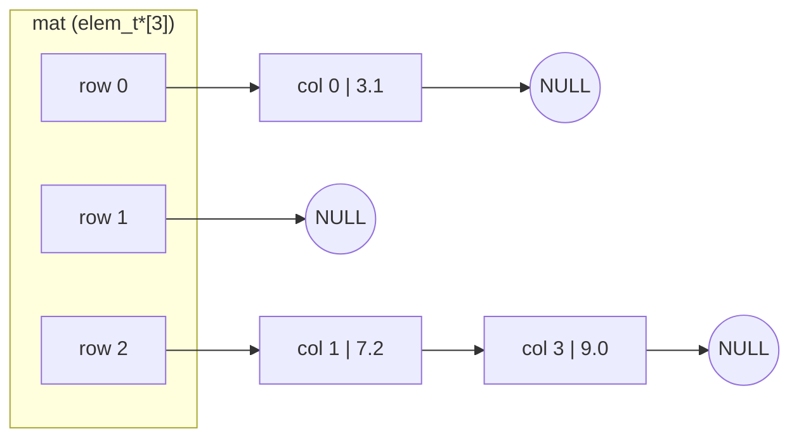
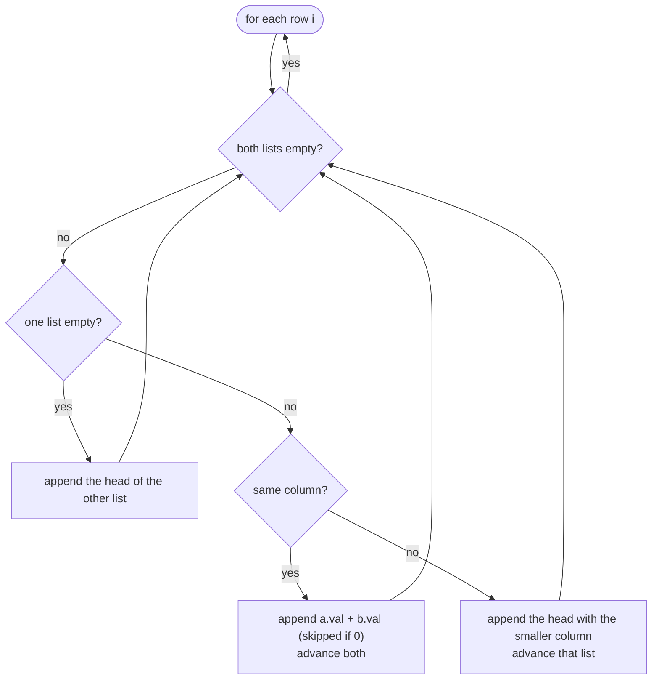
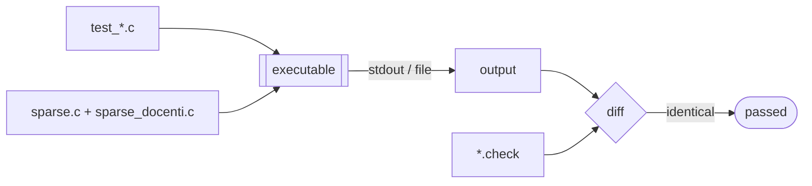

# Sparse matrix library

A small C library for **sparse matrices of `double`**: create them, read and write single elements, add, multiply and transpose them, and save or load them in a text or binary file format.

This was the midterm project of the *Laboratorio di Sistemi Operativi* (Operating Systems Lab) course at the Department of Computer Science, University of Pisa. The course staff provided the public interface ([`sparse.h`](https://github.com/matteogiorgi/sparse/blob/master/src/sparse.h)), the print function ([`sparse_docenti.c`](https://github.com/matteogiorgi/sparse/blob/master/src/sparse_docenti.c)), the reference tests and the `Makefile` skeleton; the implementation in [`sparse.c`](https://github.com/matteogiorgi/sparse/blob/master/src/sparse.c) and the extra tests were written by Matteo Giorgi and Andrea Quarta.

- [Project specs](sparse.pdf) (`sparse.pdf`)
- [Full original instructions](https://github.com/matteogiorgi/sparse/blob/master/src/README.txt) (`src/README.txt`)


## Data structure

A matrix is called *sparse* when only a tiny fraction of its entries are non-zero. Storing it densely costs $O(n \cdot m)$ memory, but storing only the non-zero entries costs $O(n + \text{nnz})$, where $\text{nnz}$ is the number of non-zero entries.

This library stores a matrix as an array of row pointers. Each row is a singly linked list of its non-zero entries, sorted by column index. A row whose entries are all zero is just a `NULL` pointer.

```c
typedef struct elem {
    unsigned col;        /* column index                  */
    double val;          /* value (never 0)               */
    struct elem * next;  /* next non-zero in the same row */
} elem_t;

typedef struct {
    elem_t ** mat;       /* array of nrow list heads      */
    int nrow;
    int ncol;
} smatrix_t;
```

For example, the matrix

$$
A = \begin{pmatrix}
3.1 & 0   & 0 & 0   \\
0   & 0   & 0 & 0   \\
0   & 7.2 & 0 & 9.0
\end{pmatrix}
$$

is stored like this:



The library keeps two rules true for every matrix:

1. **No explicit zeros.** Writing `0` to an entry removes its list node. Sums and products that come out to `0` are never inserted.
2. **Sorted rows.** Each row list is sorted by strictly increasing `col`. The merge in `sum_smat`, the comparison in `is_equal_smat` and the output of `print_smat` all depend on this order.


## API

All functions are declared in [`src/sparse.h`](https://github.com/matteogiorgi/sparse/blob/master/src/sparse.h). Every function that allocates memory returns a new matrix that the caller owns and must free with `free_smat`.

| Function | Description | Returns |
|---|---|---|
| `smatrix_t* new_smat(unsigned n, unsigned m)` | Creates an empty $n \times m$ matrix | the new matrix, `NULL` on error |
| `void free_smat(smatrix_t** pm)` | Frees the matrix and all its nodes, then sets `*pm = NULL` | — |
| `int put_elem(smatrix_t* m, unsigned i, unsigned j, double d)` | Sets $m_{ij} = d$; writing `0` removes the entry | `0` on success, `-1` on error |
| `int get_elem(smatrix_t* m, unsigned i, unsigned j, double* pd)` | Reads $m_{ij}$ into `*pd` | `0` on success, `-1` on error |
| `bool_t is_equal_smat(smatrix_t* a, smatrix_t* b)` | Compares two matrices entry by entry | `TRUE` / `FALSE` |
| `smatrix_t* sum_smat(smatrix_t* a, smatrix_t* b)` | $C = A + B$ | new matrix, `NULL` on error |
| `smatrix_t* prod_smat(smatrix_t* a, smatrix_t* b)` | $C = A \cdot B$ | new matrix, `NULL` on error |
| `smatrix_t* transp_smat(smatrix_t* a)` | $C = A^{\mathsf{T}}$ | new matrix, `NULL` on error |
| `smatrix_t* load_smat(FILE* fd)` | Reads a matrix in [text format](#text-format) | new matrix, `NULL` on error |
| `int save_smat(FILE* fd, smatrix_t* m)` | Writes a matrix in text format | `0` / `-1` |
| `smatrix_t* loadbin_smat(FILE* fd)` | Reads a matrix in [binary format](#binary-format) | new matrix, `NULL` on error |
| `int savebin_smat(FILE* fd, smatrix_t* m)` | Writes a matrix in binary format | `0` / `-1` |
| `void print_smat(FILE* f, smatrix_t* m)` | Prints the non-empty rows (provided by the course staff) | — |


### Example

```c
#include <stdio.h>
#include "sparse.h"

int main(void) {
    smatrix_t *a = new_smat(3, 3), *b = new_smat(3, 3);

    put_elem(a, 0, 1, 1.0);
    put_elem(a, 2, 0, 1.0);
    put_elem(b, 0, 0, 1.0);
    put_elem(b, 1, 1, 1.0);

    smatrix_t *s = sum_smat(a, b);
    smatrix_t *p = prod_smat(a, b);
    smatrix_t *t = transp_smat(s);

    print_smat(stdout, s);

    FILE *f = fopen("s.txt", "w");
    save_smat(f, s);
    fclose(f);

    free_smat(&a); free_smat(&b);
    free_smat(&s); free_smat(&p); free_smat(&t);
    return 0;
}
```

`print_smat` prints each non-empty row as `row: <col,val><col,val>...`, followed by a blank line:

```
0: <0,1.000000><1,1.000000>
1: <1,1.000000>
2: <0,1.000000>
```


## Algorithms

Each operation builds its result row by row, adding nodes in increasing column order. So the library can append every node at the tail of its row in $O(1)$, by keeping a tail pointer. The `INS_TAIL` macro in `sparse.c` does this, and also skips zero values.

In the table below, $\text{nnz}(A)$ is the number of non-zero entries of $A$, and $\text{nnz}(A_{i,:})$ is the number in row $i$.


### `put_elem`: sorted insertion

The internal function `put` walks row $i$ recursively until it finds the right position for column $j$. Then it does one of four things:

| Situation                       | Action                                                                 |
|---------------------------------|------------------------------------------------------------------------|
| `d != 0`, column `j` is present | overwrite the value                                                    |
| `d != 0`, column `j` is absent  | allocate a node and link it before the first node with a larger column |
| `d == 0`, column `j` is present | unlink and free the node                                               |
| `d == 0`, column `j` is absent  | do nothing                                                             |

Cost: $O(\text{nnz}(A_{i,:}))$.


### `sum_smat`: merging sorted rows

Since both row lists are sorted, the sum is a merge, just like the merge step of merge sort:

$$
c_{ij} = a_{ij} + b_{ij}
$$



Cost: $O\big(n + \text{nnz}(A) + \text{nnz}(B)\big)$.


### `prod_smat`: row-wise product with a dense accumulator

Row $i$ of $C$ is a linear combination of the rows of $B$, weighted by the non-zero entries of row $i$ of $A$:

$$
C_{i,:} \;=\; \sum_{k \,:\, a_{ik} \neq 0} a_{ik}\, B_{k,:}
\qquad\text{i.e.}\qquad
c_{ij} = \sum_{k} a_{ik}\, b_{kj}
$$

For each row $i$:

1. Walk row $i$ of $A$. For each non-zero $a_{ik}$, walk row $k$ of $B$ and add $a_{ik}\,b_{kj}$ to `tmp[j]`. Here `tmp` is a dense `double[ncol_B]` array, allocated once and reused for every row.
2. Scan `tmp` from left to right. Append every non-zero `tmp[j]` to row $i$ of $C$, which keeps the row sorted for free, and reset `tmp[j]` to `0`.

Cost: $O\big(\sum_{a_{ik}\neq 0} \text{nnz}(B_{k,:}) \;+\; n_A \cdot m_B\big)$. The second term, from scanning the dense array, is the largest cost for big matrices (see the [benchmark](#benchmark)).


### `transp_smat`: one pass with per-column tails

The function visits $A$ from top to bottom and sends each entry $a_{ij}$ to row $j$ of $A^{\mathsf{T}}$ at column $i$. Since $i$ only grows during the visit, every row of the result receives its columns in sorted order. An auxiliary array of `ncol` tail pointers makes each append $O(1)$.

Cost: $O\big(n + m + \text{nnz}(A)\big)$.


### Summary

| Operation               | Time                                                          |
|-------------------------|---------------------------------------------------------------|
| `put_elem` / `get_elem` | $O(\text{nnz}(A_{i,:}))$                                      |
| `is_equal_smat`         | $O(n + \text{nnz})$                                           |
| `sum_smat`              | $O(n + \text{nnz}(A) + \text{nnz}(B))$                        |
| `prod_smat`             | $O\big(\sum_{a_{ik}\neq 0}\text{nnz}(B_{k,:}) + n_A m_B\big)$ |
| `transp_smat`           | $O(n + m + \text{nnz}(A))$                                    |
| `free_smat`             | $O(n + \text{nnz})$                                           |


## File formats

### Text format

The first line holds the number of rows and the second line the number of columns. After that comes one `row col value` triple per non-zero entry:

```
nrow
ncol
row_1 col_1 val_1
...
row_k col_k val_k
```

Example, from [`src/DATA/data1.txt`](https://github.com/matteogiorgi/sparse/blob/master/src/DATA/data1.txt):

```
3
4
1 1 4.5
2 0 9
2 2 89.67
```

`load_smat` inserts the triples through `put_elem`, so they may appear in any order. Loading fails with `NULL` if the header cannot be read, if a triple is incomplete, or if an index is out of range. For example, [`data2.txt`](https://github.com/matteogiorgi/sparse/blob/master/src/DATA/data2.txt) has row 20 in a 20-row matrix, and [`data3.txt`](https://github.com/matteogiorgi/sparse/blob/master/src/DATA/data3.txt) has a negative row count. `save_smat` writes the triples in row-major order, with values printed using `%lf`.


### Binary format

The binary format, designed by the authors as the specs required, stores the same information as raw values in the machine's native byte order:

| Field                    | Type       | Size (on a typical x86-64 / LP64 system) |
|--------------------------|------------|------------------------------------------|
| `nrow`                   | `int`      | 4 B                                      |
| `ncol`                   | `int`      | 4 B                                      |
| for each non-zero: `row` | `int`      | 4 B                                      |
| for each non-zero: `col` | `unsigned` | 4 B                                      |
| for each non-zero: `val` | `double`   | 8 B                                      |

So a matrix with $k$ non-zero entries takes $8 + 16k$ bytes. For example, the 3-element matrix saved by `test_five` is 56 bytes. `loadbin_smat` reads triples until EOF. If the file ends in the middle of a triple, it frees the partial matrix and returns `NULL`. The format is not portable between machines with different endianness or `int` size.


## Error handling

Every library function first sets `errno = 0`. On failure it sets `errno` and returns the error value from the [API table](#api). Callers can therefore use `perror`, as `test_five.c` does.

| `errno`   | Meaning                                                                                  |
|-----------|------------------------------------------------------------------------------------------|
| `EINVAL`  | `NULL` matrix, `NULL` file or `NULL` output pointer, or index out of range in `put_elem` |
| `ENOTSUP` | incompatible dimensions (`sum_smat`, `prod_smat`), or index out of range in `get_elem`   |
| `ENOMEM`  | `malloc` / `calloc` failed (`new_smat`, node allocation)                                 |
| `EIO`     | malformed input or failed read/write in `load*` / `save*`                                |

Indices are `unsigned`, so a negative index such as `put_elem(m, -1, 0, x)` wraps around to a huge value and is rejected as out of range. In the same way, `new_smat(-1, n)` asks for an impossibly large array and fails with `ENOMEM`.


## Building and testing

You need `gcc`, `make` and (only for the `consegna` target) `perl`. All commands run inside `src/`:

```bash
cd src
make test1      # creation, put/get, writing zeros
make test2      # sums, including entries that cancel out to zero
make test3      # transpose and product
make test4      # text and binary save/load round trips, malformed files
make test5      # authors' test: every function on small 3x3 matrices
make testTime   # authors' benchmark on 100000 x 100000 matrices
make cleanall   # remove objects and executables
```

Tests 1–3 and 5 save the program output and `diff` it against a reference file (`DATA/out_test_*.check` and `out_test_five.check`). Test 4 checks its results inside the program, with `is_equal_smat` and the return values. Each successful target ends with `********** TestN superato!` ("test N passed").



The compiler flags are `-Wall -pedantic -g -O3`. The `-O3` flag was added by the authors for the benchmark. The `consegna` ("submission") target runs tests 1–4, checks `gruppo.txt` with `gruppo-check.pl`, and builds the tarball that was sent to the course staff.


## Benchmark

[`time_execution.c`](https://github.com/matteogiorgi/sparse/blob/master/src/time_execution.c) fills two $10^5 \times 10^5$ matrices at random (fewer than 1000 non-zeros per row) and times each operation with `clock()`. These are the authors' results on an Intel Core i5-2540M @ 2.60 GHz:

| Step                     | Time    |
|--------------------------|---------|
| random fill (one matrix) | 0.46 s  |
| sum                      | 0.37 s  |
| product                  | 23.85 s |
| transpose                | 0.78 s  |

The product is the slowest step mainly because of the dense accumulator scan, which costs $n_A \cdot m_B = 10^{10}$ steps no matter how sparse the matrices are.


## Repository layout

```
.
├── README.md
├── LICENSE                  GPL-3.0
├── sparse.pdf               project specs (Italian)
└── src/
    ├── sparse.h             public interface and data types        [course staff]
    ├── sparse_docenti.c     print_smat implementation              [course staff]
    ├── sparse.c             library implementation                 [authors]
    ├── test_one.c … test_four.c   reference tests                  [course staff]
    ├── test_five.c          functional test on small matrices      [authors]
    ├── time_execution.c     performance benchmark                  [authors]
    ├── out_test_five.check  expected output of test_five           [authors]
    ├── DATA/                input data and expected outputs        [course staff]
    ├── Makefile             build and test targets
    ├── INSTRUCTIONS.txt     notes on the extra tests (Italian)     [authors]
    ├── README.txt           original assignment (Italian)          [course staff]
    ├── README.doxygen       notes on Doxygen comments (Italian)    [course staff]
    ├── gruppo.txt           group members
    └── gruppo-check.pl      checks the format of gruppo.txt        [course staff]
```


## Known limitations

This is a course project, kept as it was submitted. These are known problems:

- **`get_elem` crashes when the entry is zero in some cases.** The search loop tests `cols_mat->col != j` before `cols_mat != NULL`. So reading from an empty row, or reading a column after the last non-zero of its row, dereferences `NULL`. The reference tests only read entries that exist, so they don't catch this. The fix is to swap the two conditions and return `0` when the node is `NULL`.
- **Memory leaks on error paths.** If `new_smat` fails inside `prod_smat`, the `tmp` buffer is not freed; if it fails inside `transp_smat`, the `tail` array is not freed. `calloc` for `tmp` is also never checked.
- **Exact floating-point comparison.** `is_equal_smat` compares values with `==`, and an entry counts as zero only if it is exactly `0.0`.
- **Mixed `int` / `unsigned` types.** `nrow` and `ncol` are `int`, while indices are `unsigned`. Very large dimensions, or negative ones read from a file, are only caught indirectly.
- **Makefile quirks.** `FILE_DA_CONSEGNARE` lists `MY_README.TXT`, but the file in the repo is `INSTRUCTIONS.txt`. The rule `time_execution.o: time_execution.o sparse.h` depends on itself.
